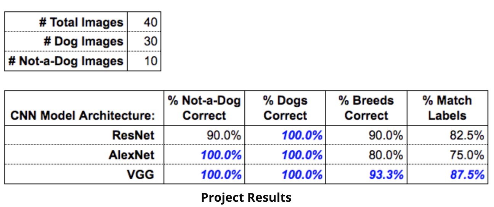

# Pre-trained Dog Identity Image Classifier

Your city is hosting a citywide dog show and you have volunteered to help the organizing committee with contestant registration. Every participant that registers must submit an image of their dog along with biographical information about their dog. The registration system tags the images based upon the biographical information.

### Principal Objectives:

1. Correctly identify which pet images are of dogs (even if the breed is misclassified) and which pet images aren't of dogs.
2. Correctly classify the breed of dog, for the images that are of dogs.
3. Determine which CNN model architecture (ResNet, AlexNet, or VGG), "best" achieve objectives 1 and 2.
4. Consider the time resources required to best achieve objectives 1 and 2, and determine if an alternative solution would have given a "good enough" result, given the amount of time each of the algorithms takes to run.

### How to run the program:
1. Enter the following in the terminal to rull all 3 models: sh run_models_batch.sh
2. Run each individually in the terminal:

   -- python check_images.py --dir pet_images/ --arch resnet  --dogfile dognames.txt

   -- python check_images.py --dir pet_images/ --arch alexnet  --dogfile dognames.txt

   -- python check_images.py --dir pet_images/ --arch vgg  --dogfile dognames.txt 

### Architecture Results may be found in:

- vgg_pet-images.txt
- resnet_pet-images.txt
- alexnet_pet-iamges.txt

